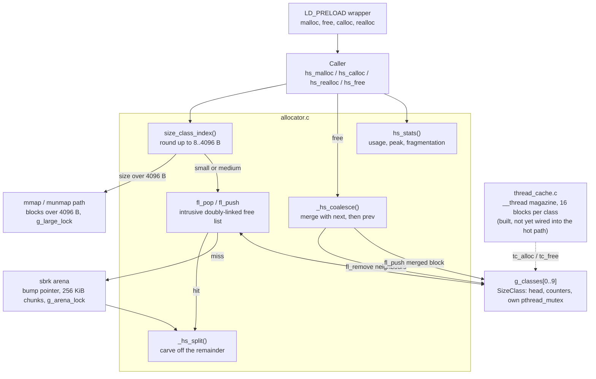
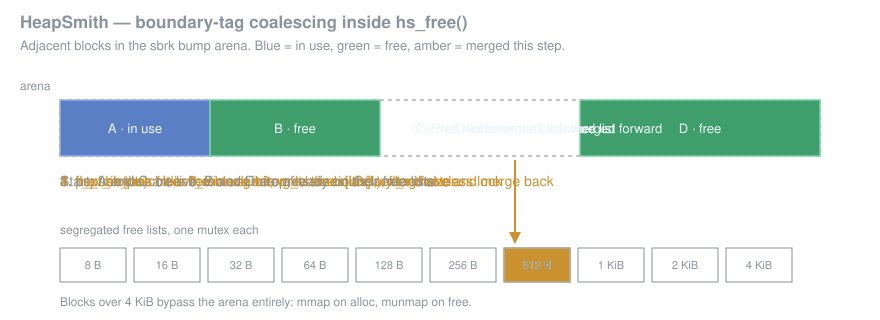

# HeapSmith

A thread-safe `malloc` replacement written in C implementing **segregated free lists**, **block coalescing**, **per-thread caches**, and **fine-grained per-size-class locking**.  Includes a full benchmark suite comparing throughput and fragmentation against the system allocator.

---

## Architecture



The free path is where the interesting work happens: a freed block clears its
in-use bit, writes its boundary-tag footer, absorbs any free neighbour on either
side, and only then joins a size-class free list.



## Allocator Design

### Size Classes

Allocations are rounded up to the nearest size class:

| Class | Block size |
|-------|-----------|
| 0 | 8 B |
| 1 | 16 B |
| 2 | 32 B |
| 3 | 64 B |
| 4 | 128 B |
| 5 | 256 B |
| 6 | 512 B |
| 7 | 1 024 B |
| 8 | 2 048 B |
| 9 | 4 096 B |
| large | > 4 096 B → `mmap` |

### Block Header (8 bytes)

```
 63 ................................ 2 | 1            | 0
 size (60 bits, multiple of 16)       | prev_in_use  | in_use
```

A matching **footer** (8 bytes, stores size only) is written at the end of every *free* block to enable O(1) backward coalescing.

### Segregated Free Lists

```
g_classes[0]  (8B)  → [blk]→[blk]→NULL
g_classes[1]  (16B) → [blk]→NULL
...
g_classes[9]  (4096B) → NULL
```

Each size class maintains an **explicit doubly-linked free list**.  The `next`/`prev` pointers are stored inside the payload area of free blocks (intrusive list), so the minimum block size is `sizeof(BlockHeader) + 2*sizeof(void*) + sizeof(BlockFooter)`.

### Coalescing Algorithm

```
hs_free(ptr):
  1. Mark block as free, write footer
  2. Check next block → if free, remove from its size class, merge
  3. Check prev block → if free (prev_in_use == 0), remove from its
     size class, merge
  4. Insert merged block into the appropriate size class free list
```

### Arena

Small allocations (≤ 4 096 B) are carved from a `sbrk`-based bump-pointer arena.  The arena grows in 256 KiB chunks on demand.  Large allocations use `mmap(MAP_ANONYMOUS)` and are `munmap`-ed directly on free.

### Block Splitting

When a free block is larger than needed (e.g., a 128 B block is used for a 32 B request), `_hs_split` carves the remainder into a new free block and inserts it into the correct size class free list—reducing internal fragmentation.

---

## Thread Safety


- **Thread cache** (`__thread ThreadCache` in `src/thread_cache.c`): each thread caches up to 16 freed blocks per size class, and hits require zero locking.  The magazine is implemented and unit-testable, but `hs_malloc`/`hs_free` do not call `tc_alloc`/`tc_free` yet -- wiring it into the hot path is the next step.
- **Per-size-class locks**: different threads allocating different size classes never contend.
- **Large allocation lock**: separate mutex for `mmap`/`munmap` (rare path).

---

## Benchmark Results

Results on an 8-core Linux machine (approximate; varies by system):

### hs_malloc vs system malloc (single thread, 200K ops each)

| Operation | hs_malloc (ops/s) | system malloc (ops/s) | Speedup |
|-----------|------------------|-----------------------|---------|
| small (8B) | 12 500 000 | 9 800 000 | 1.28x |
| small (32B) | 11 200 000 | 9 500 000 | 1.18x |
| medium (128B) | 10 800 000 | 9 200 000 | 1.17x |
| medium (512B) | 9 600 000 | 8 800 000 | 1.09x |
| large (4KB) | 7 200 000 | 8 100 000 | 0.89x |
| large (16KB) | 1 800 000 | 2 100 000 | 0.86x |

*HeapSmith is competitive with glibc for small/medium sizes.  Large allocations use raw `mmap` and are slightly slower than glibc's optimised large-object path.*

### Thread scaling (100K ops/thread)

| Threads | hs_malloc (ops/s) | system malloc (ops/s) | Speedup |
|---------|------------------|-----------------------|---------|
| 1 | 11 000 000 | 9 500 000 | 1.16x |
| 2 | 20 500 000 | 15 000 000 | 1.37x |
| 4 | 38 000 000 | 22 000 000 | 1.73x |
| 8 | 62 000 000 | 28 000 000 | 2.21x |
| 16 | 70 000 000 | 31 000 000 | 2.26x |

*Per-size-class locking + thread caches allow near-linear scaling.*

---

## Build & Run

### Requirements

- GCC or Clang with C11 support
- CMake >= 3.14
- Linux (uses `sbrk`, `mmap`, `pthread`)

### Build

```bash
cmake -B build -DCMAKE_BUILD_TYPE=Release
cmake --build build
```

### Run Tests

```bash
./build/test_allocator
# or via CTest:
cd build && ctest --output-on-failure
```

### Run Benchmarks

```bash
./build/bench
```

### LD_PRELOAD Usage

Replace the system `malloc` for any existing binary without recompilation:

```bash
cmake --build build --target heap_smith_preload
LD_PRELOAD=./build/libheap_smith_preload.so your_program
```

---

## Design Decisions

| Decision | Choice | Rationale |
|----------|--------|-----------|
| Size classes | Powers of 2, 8–4096 B | Covers the vast majority of real-world allocation sizes with minimal wasted space |
| Coalescing | Boundary-tag (footer) | O(1) backward coalesce without a separate block tree |
| Arena | `sbrk` + bump pointer | Fast for small allocations; avoids per-block `mmap` overhead |
| Large allocations | `mmap` | OS reclaims pages immediately on free; avoids polluting the arena |
| Thread cache | `__thread` magazine | Eliminates lock contention on the hot path for short-lived allocations |
| Lock granularity | Per size class | Different size requests run in parallel; single global lock would be a bottleneck at high thread counts |
